# Análise de Hipóteses — Músicas mais ouvidas no Spotify (2023)

> Projeto realizado durante o Bootcamp de Especialização em Data Analysis da [Laboratória Brasil](https://www.laboratoria.la/br).

## Links

| Recurso | Link |
|---|---|
| Apresentação (PDF) | [Google Drive](https://drive.google.com/file/d/1YnPTOWRMnsW291v9dAaMtU49sEKE_QN4/view) |
| Dashboard Power BI | [Acessar dashboard](https://app.powerbi.com/view?r=eyJrIjoiYTE1M2IxNDEtMmY0OC00ZDZiLWFjMjMtMWI1ODFkZDgyOWJjIiwidCI6IjRhNWRiNDI3LTllNTgtNDQ5MC04ZDY4LWYxOWJlYjRiNzlmMCJ9) |
| Vídeo de apresentação (Loom) | [Assistir](https://www.loom.com/share/4142893d432e4b7daec5ae6aeb1f1eae) |
| Análise estatística (Colab) | [Abrir no Colab](https://colab.research.google.com/drive/1DoGV9qHeNQFyMAKRSwS0yJI5cxyJN-h_?usp=sharing) |

---

## Sumário

- [Contexto e Objetivo](#contexto-e-objetivo)
- [Hipóteses](#hipóteses)
- [Ferramentas](#ferramentas)
- [Metodologia](#metodologia)
- [Resultados e Validação das Hipóteses](#resultados-e-validação-das-hipóteses)

---

## Contexto e Objetivo

Uma gravadora enfrenta o desafio de lançar um novo artista no cenário musical global e conta com um extenso conjunto de dados do Spotify sobre as músicas mais ouvidas em 2023.

O objetivo é **validar ou refutar hipóteses** a partir da análise de dados, fornecendo estratégias para que a gravadora e o artista tomem decisões que aumentem as chances de sucesso.

---

## Hipóteses

| # | Hipótese |
|---|---|
| H1 | Músicas com BPM mais altos fazem mais sucesso em streams |
| H2 | Músicas populares no Spotify têm comportamento semelhante em outras plataformas (ex.: Deezer) |
| H3 | Presença em mais playlists está correlacionada com mais streams |
| H4 | Artistas com mais músicas no Spotify têm mais streams |
| H5 | Características musicais influenciam o sucesso em streams |

---

## Ferramentas

---

## Metodologia

### 1. Pré-processamento

Três tabelas foram importadas no BigQuery dentro do dataset `projeto2`: `track_in_spotify`, `track_technical_info` e `track_in_competition`.

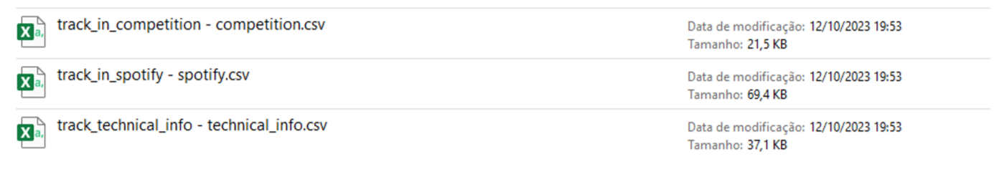
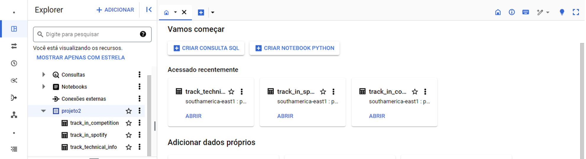

---

### 2. Processar e preparar a base de dados

**2.1 Valores nulos**

A coluna `in_shazam_charts` apresentou 50 nulos e foi excluída por não ser plataforma de streaming. As colunas `key` e `mode` também foram descartadas por estarem fora do escopo analítico.

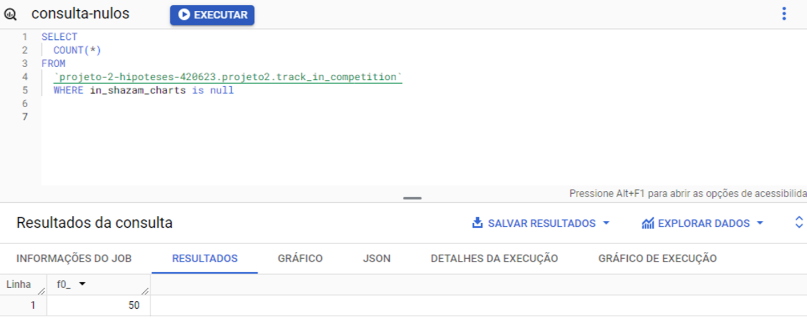

Resumo de nulos por tabela:

**track_technical_info**

| Coluna | Nulos |
|---|---|
| track_id | 0 |
| bpm | 0 |
| key | 95 |
| mode | 0 |
| danceability__ | 0 |
| valence__ | 0 |
| energy__ | 0 |
| acousticness__ | 0 |
| instrumentalness__ | 0 |
| liveness__ | 0 |
| speechiness__ | 0 |

**track_in_spotify**

| Coluna | Nulos |
|---|---|
| track_id | 0 |
| track_name | 0 |
| artist_s__name | 0 |
| artist_count | 0 |
| released_year | 0 |
| released_month | 0 |
| released_day | 0 |
| in_spotify_playlists | 0 |
| in_spotify_charts | 0 |
| streams | 0 |

**track_in_competition**

| Coluna | Nulos |
|---|---|
| track_id | 0 |
| in_apple_playlists | 0 |
| in_apple_charts | 0 |
| in_deezer_playlists | 0 |
| in_deezer_charts | 0 |
| in_shazam_charts | **50** |

**2.2 Duplicatas**

Identificadas 4 músicas duplicadas em `track_in_spotify`. O agrupamento foi feito por `track_name` + `artist_s__name` (e não por `track_id`, que pode se repetir entre artistas diferentes):

| track_name | artist_s__name |
|---|---|
| SNAP | Rosa Linn |
| About Damn Time | Lizzo |
| Take My Breath | The Weeknd |
| SPIT IN MY FACE! | ThxSoMch |

**2.3 Dados fora do escopo**

Colunas `key` e `mode` (track_technical_info) e `in_shazam_charts` (track_in_competition) excluídas via `SELECT * EXCEPT`.

**2.4 Discrepâncias e conversão de tipos**

- Registro com `track_id = '4061483'` removido (valor string no campo `streams`)
- Coluna `streams` convertida de `STRING` para `INT64` via `SAFE_CAST`

**2.5 Novas variáveis e união das tabelas**

- Criada coluna `release_date` concatenando `released_year`, `released_month` e `released_day`
- Criada coluna `track_count` (total de músicas por artista)
- Tabelas unidas via `JOIN` em `track_id`

> Todas as queries estão documentadas em [`queries.sql`](./queries.sql).

---

### 3. Análise Exploratória (Power BI)

**Matrizes por hipótese**

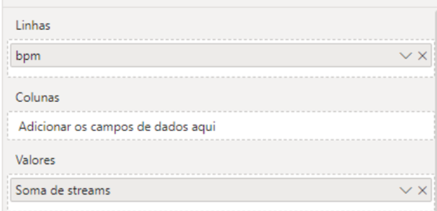
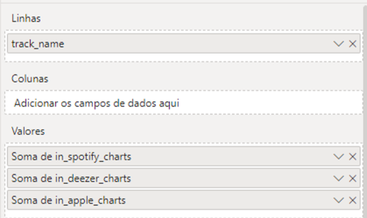
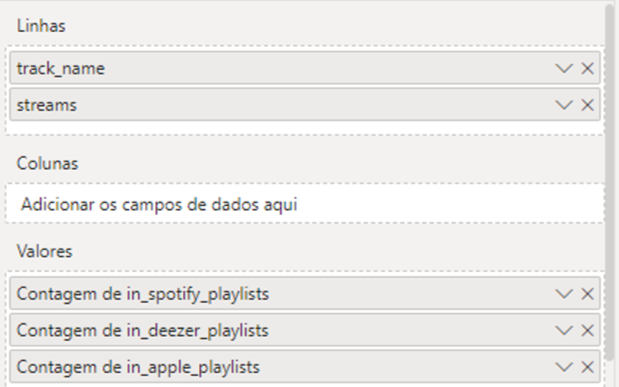
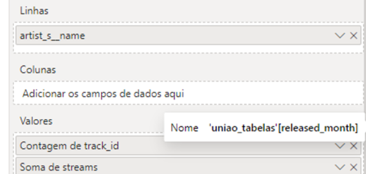

**Medidas de tendência central** (soma, média e mediana por variável)

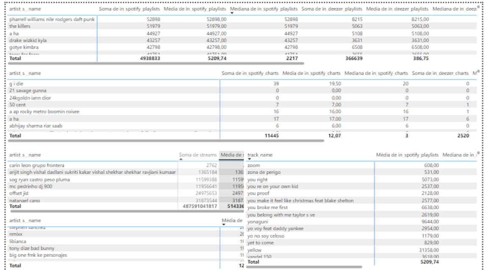

**Distribuição — histogramas (Python no Power BI)**

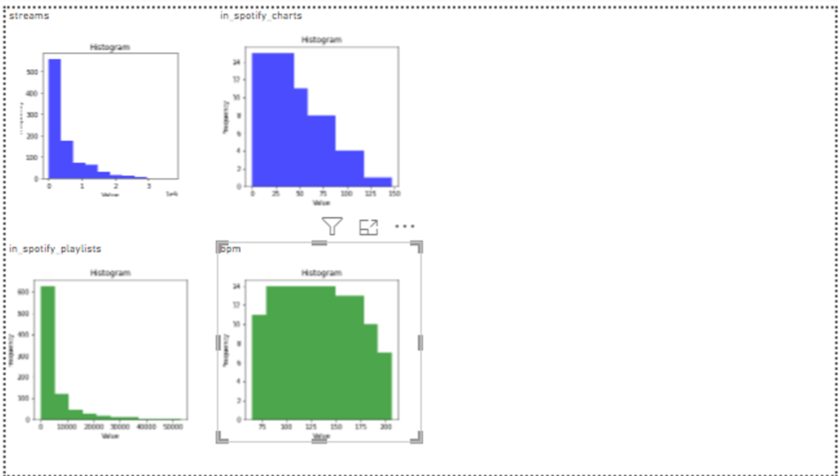

**Medidas de dispersão** (desvio padrão e variância)

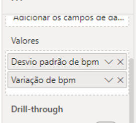
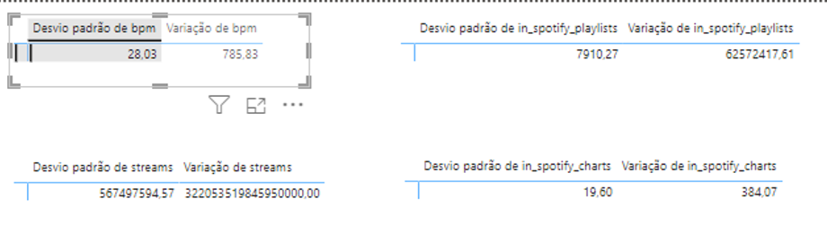

**Comportamento ao longo do tempo**

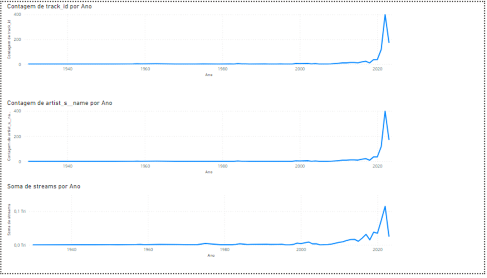

**Estatísticas descritivas — track_in_spotify**

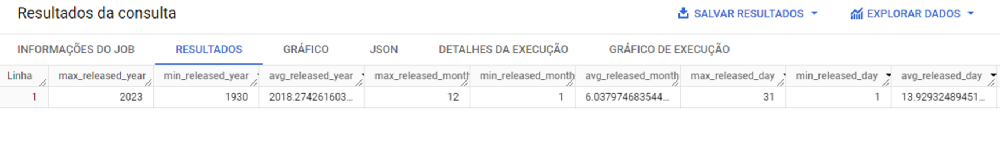
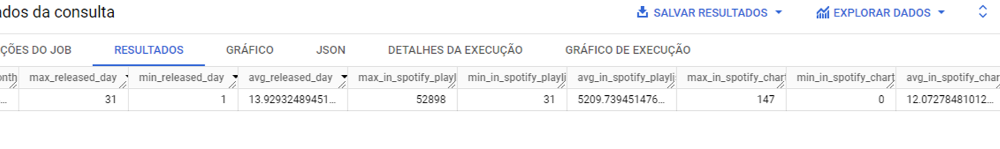

**Estatísticas descritivas — track_technical_info**

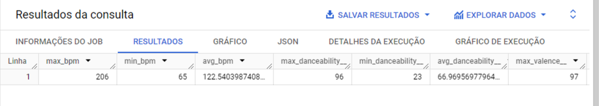
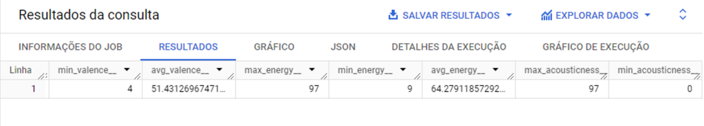
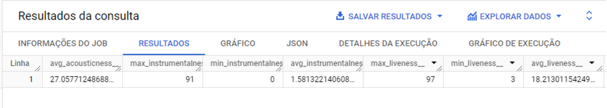
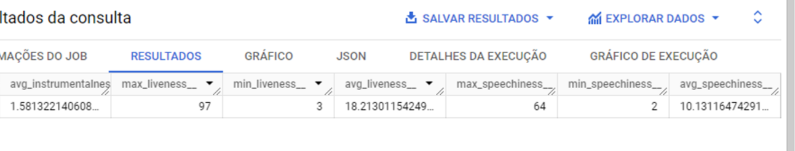

**Estatísticas descritivas — track_in_competition**

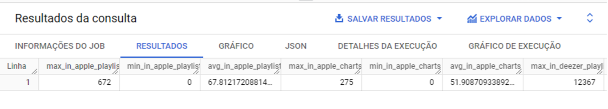
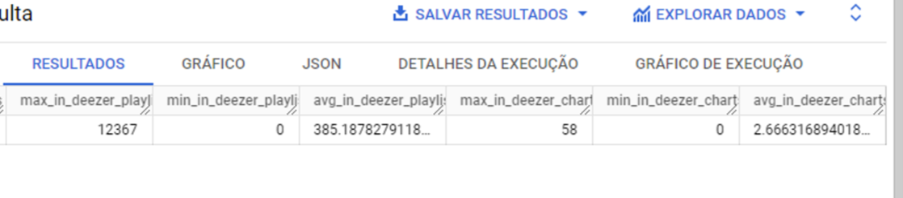

---

### 4. Técnicas de Análise

**Segmentação por quartis de streams**

A base foi dividida em 4 grupos pelo quartil de streams. As matrizes usam o quartil como linha e a média das variáveis como valor:

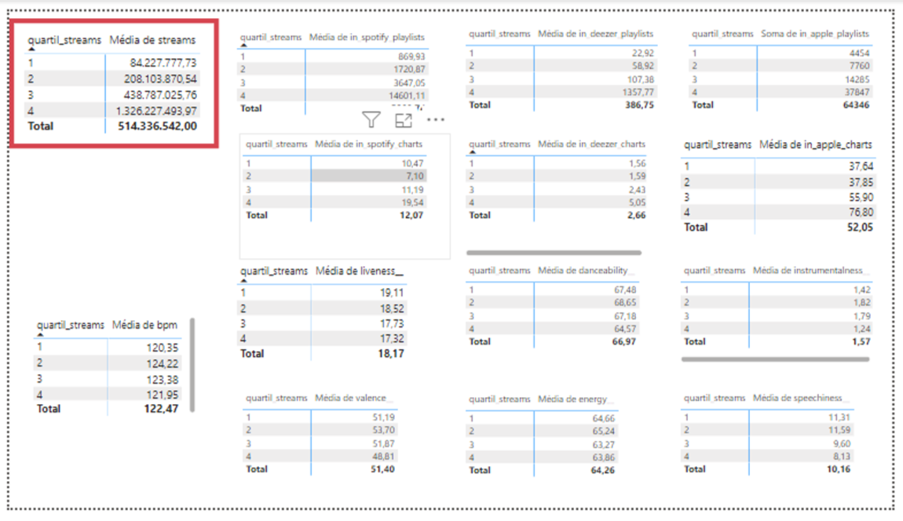

**Correlação de Pearson**

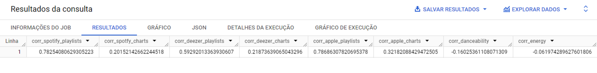
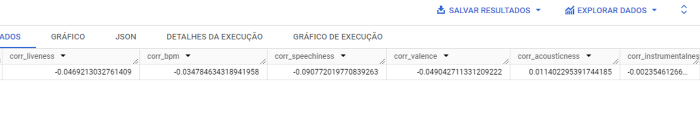

**Correlação de Spearman**

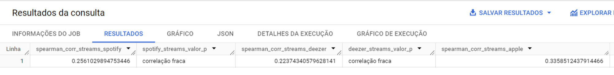
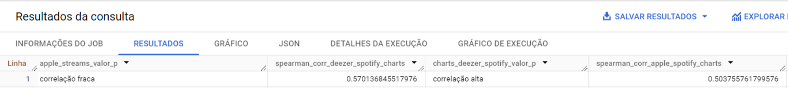
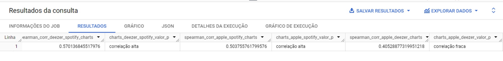

**Teste de significância — Mann-Whitney U** (Google Colab)

Aplicado para comparar streams entre grupos de BPM alto e baixo. Script disponível em [`queries.sql`](./queries.sql).

---

## Resultados e Validação das Hipóteses

| # | Hipótese | Resultado |
|---|---|---|
| H1 | BPM alto → mais streams | ❌ Refutada |
| H2 | Popularidade Spotify ~ outras plataformas | ✅ Validada |
| H3 | Mais playlists → mais streams | ✅ Validada |
| H4 | Mais músicas no catálogo → mais streams | ❌ Refutada |
| H5 | Características musicais influenciam streams | ❌ Refutada |

**H1 — BPM não determina streams**

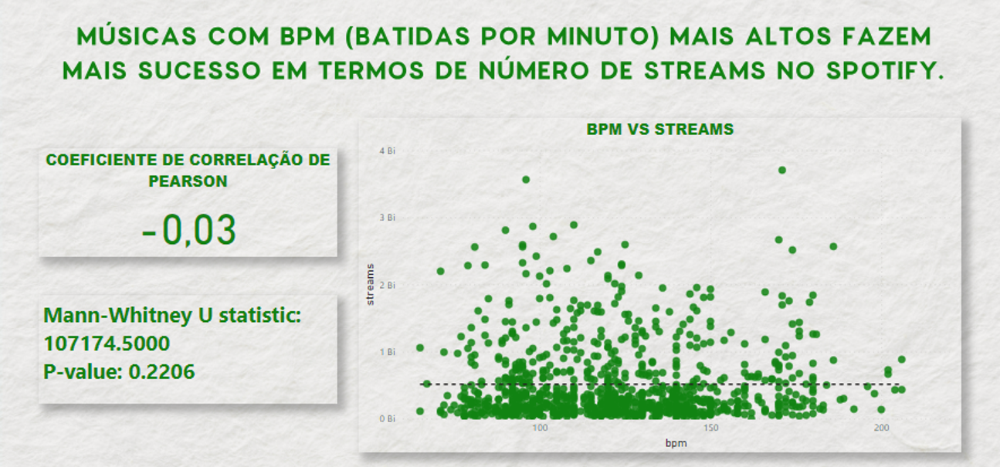

**H2 — Comportamento semelhante entre plataformas**

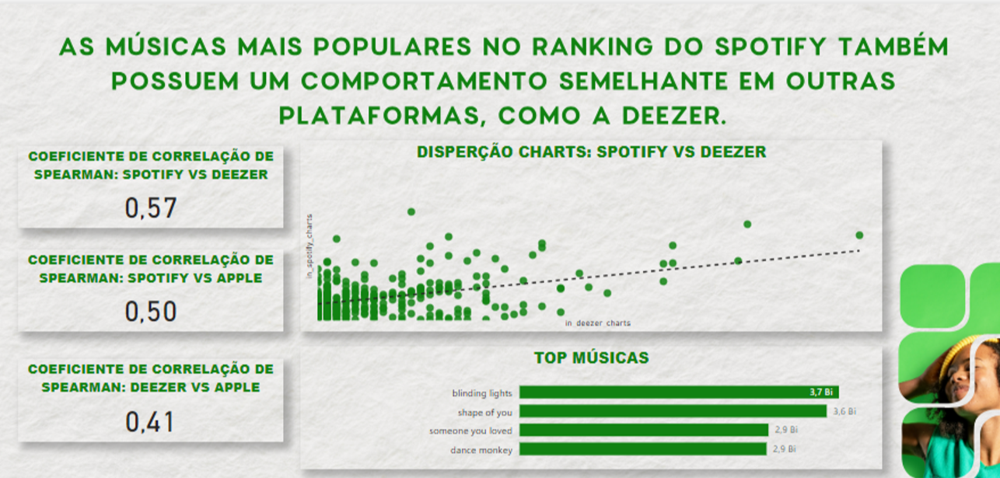

**H3 — Playlists correlacionadas com streams**

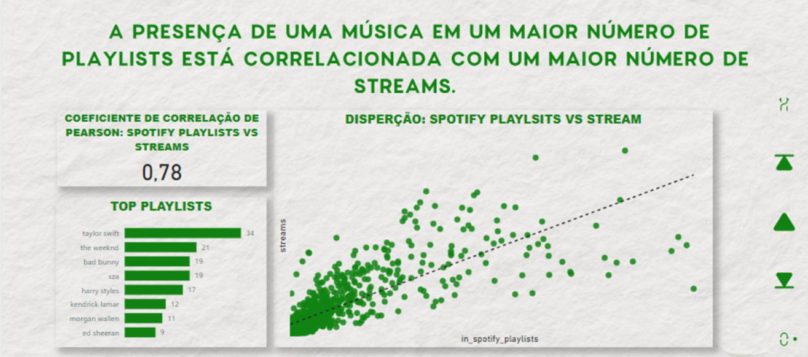

**H4 — Volume de músicas no catálogo não garante mais streams**

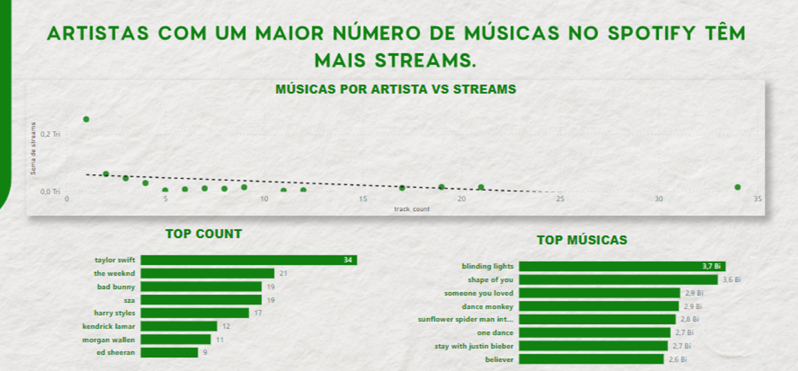

**H5 — Características musicais sem correlação com streams**

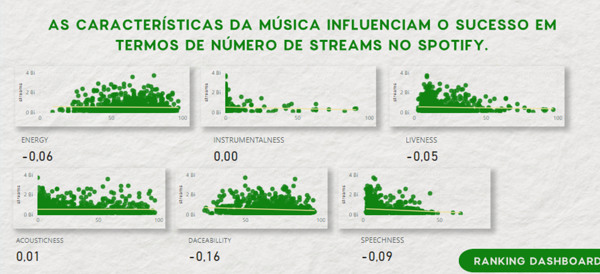
